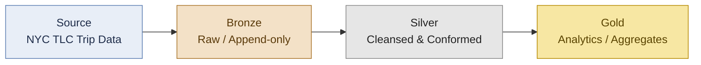

# NYC Taxi Medallion Pipeline

> End-to-end Bronze → Silver → Gold pipeline on Azure Databricks using NYC TLC trip data

   > ✅ **Status:** Complete — full medallion pipeline (Bronze, Silver, Gold) delivered April 2026. Tests and CI/CD planned next.

---

## Author

**Kumari Shishubala**
*Data Engineer | Databricks Certified Professional | London, UK*

- LinkedIn: [linkedin.com/in/your-handle](https://www.linkedin.com/in/your-handle/) <!-- TODO: replace with real profile URL -->

---

## Architecture

The pipeline follows the **medallion architecture**: raw NYC TLC trip files land in the **Bronze** layer as immutable Delta tables (schema-on-read, full history retained). The **Silver** layer applies cleansing, type-casting, and conforming — deduplication, null handling, joins to reference dimensions (e.g. taxi zones), and data-quality expectations. The **Gold** layer exposes business-ready aggregates (trip volumes, revenue, tip behaviour) optimised for BI consumption. Each layer is a Delta table managed in Unity Catalog, providing governance, lineage, and a clean three-level namespace (`catalog.schema.table`).

---
## Business Insights Surfaced
- Top revenue-generating zone: zip 11422 (Rosedale/JFK area), 7% of total revenue
   - Airport-adjacent zones disproportionately drive revenue due to longer fares and tolls
   - Quality rules caught 6 anomalous rows: 5 likely refunds, 1 likely cancellation fee — quarantined for investigation rather than dropped
## Tech Stack

- **Azure Databricks** — managed Spark compute and orchestration
- **Delta Lake** — ACID storage layer with time travel and schema evolution
- **PySpark** — distributed data transformations
- **Unity Catalog** — three-level namespace, governance, and lineage
- **Python 3.11** — typed transformation logic and unit tests

---

## Project Status

- [x] Project skeleton & scaffolding
- [X] - Bronze | ✅ Complete | Raw ingestion of NYC TLC trip data with audit metadata | April 2026
- [X] Silver | ✅ Complete | Cleansing, deduplication via row_number window, schema enforcement, 5 data-quality rules, quarantine pattern | April 2026

- [X] Gold | ✅ Complete | Star schema with dim_zones, fact_trips_daily, fact_trips_by_zone_day. Partitioned by trip_date for query performance | April 2026
- [ ] CI: lint, format, and pytest on PR
- [ ] Databricks Asset Bundle deployment

---

## What this demonstrates

- **Medallion architecture** — disciplined Bronze / Silver / Gold separation with clear contracts between layers
- **PySpark transformations** — idiomatic, typed, testable DataFrame transformations
- **Delta Lake** — ACID writes, schema evolution, time travel, `MERGE` for upserts
- **Unity Catalog three-level namespace** — `catalog.schema.table` with managed tables and grants
- **Data quality** — explicit expectations, null/duplicate handling, and quarantine of bad records
- **Separation of concerns** — reusable library code under `src/`, thin notebooks for orchestration, unit tests under `tests/`

## Recent Updates:
- **April 2026:** Initialised project, completed Bronze layer ingestion with metadata audit columns, established Unity Catalog three-level namespace.
- **April 2026:** Completed Silver layer with quarantine pattern. Implemented deterministic deduplication using Window.partitionBy().orderBy() with row_number(). Applied 5 business data-quality rules. Of 21,932 Bronze rows, 21,926 passed all quality checks; 6 rows quarantined (5 negative fares likely representing refunds, 1 zero-duration likely representing a cancellation fee).
- **April 2026:** Completed Gold layer with star schema. Built 1 dimension (dim_zones, 206 zones) and 2 fact tables (fact_trips_daily — 60 daily rows; fact_trips_by_zone_day — 3,290 zone-day rows). Surfaced first business insight: zip 11422 (Rosedale, Queens — near JFK Airport) generates 7% of total revenue.

## How to Run
- Prerequisites: Databricks workspace with Unity Catalog enabled, serverless or all-purpose compute
   - Steps: 1. Run notebooks/01_bronze_ingestion in order. 2. Run notebooks/02_silver_transformation. 3. Run notebooks/03_gold_aggregation.
   - Mention that all tables land in workspace.bronze, workspace.silver, workspace.gold schemas.
## Contacts:
-(https://linkedin.com/in/kumari-shishubala-b01b8b253) and email (kshishubala051@gmail.com).    