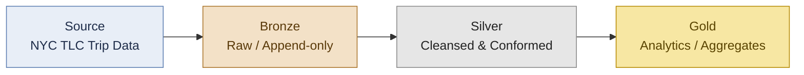

# NYC Taxi Medallion Pipeline

> End-to-end Bronze → Silver → Gold pipeline on Azure Databricks using NYC TLC trip data

> 🚧 **Status:** Actively in development — Bronze layer complete (April 2026). Silver and Gold layers in progress.

---

## Author

**Kumari Shishubala**
*Data Engineer | Databricks Certified Professional | London, UK*

- LinkedIn: [linkedin.com/in/your-handle](https://www.linkedin.com/in/your-handle/) <!-- TODO: replace with real profile URL -->

---

## Architecture

The pipeline follows the **medallion architecture**: raw NYC TLC trip files land in the **Bronze** layer as immutable Delta tables (schema-on-read, full history retained). The **Silver** layer applies cleansing, type-casting, and conforming — deduplication, null handling, joins to reference dimensions (e.g. taxi zones), and data-quality expectations. The **Gold** layer exposes business-ready aggregates (trip volumes, revenue, tip behaviour) optimised for BI consumption. Each layer is a Delta table managed in Unity Catalog, providing governance, lineage, and a clean three-level namespace (`catalog.schema.table`).

---

## Tech Stack

- **Azure Databricks** — managed Spark compute and orchestration
- **Delta Lake** — ACID storage layer with time travel and schema evolution
- **PySpark** — distributed data transformations
- **Unity Catalog** — three-level namespace, governance, and lineage
- **Python 3.11** — typed transformation logic and unit tests

---

## Project Status

- [x] Project skeleton & scaffolding
- [ ] **Bronze layer** — ingestion of NYC TLC raw files *(in progress)*
- [ ] Silver layer — cleansed & conformed trip facts
- [ ] Gold layer — analytics aggregates
- [ ] CI: lint, format, and pytest on PR
- [ ] Databricks Asset Bundle deployment

---

## What this demonstrates

- **Medallion architecture** — disciplined Bronze / Silver / Gold separation with clear contracts between layers
- **PySpark transformations** — idiomatic, typed, testable DataFrame transformations
- **Delta Lake** — ACID writes, schema evolution, time travel, `MERGE` for upserts
- **Unity Catalog three-level namespace** — `catalog.schema.table` with managed tables and grants
- **Data quality** — explicit expectations, null/duplicate handling, and quarantine of bad records
- **Separation of concerns** — reusable library code under `src/`, thin notebooks for orchestration, unit tests under `tests/`

## Recent Updates:
- **April 2026:** Initialised project, completed Bronze layer ingestion with metadata audit columns, established Unity Catalog three-level namespace.
## Contacts:
-(https://linkedin.com/in/kumari-shishubala-b01b8b253) and email (kshishubala051@gmail.com).    