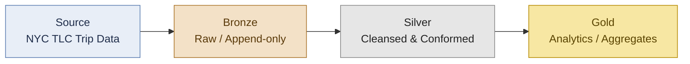

# Architecture — Medallion Pipeline

## Overview

This pipeline implements the **medallion architecture** pattern on Azure Databricks
with Delta Lake and Unity Catalog. Data flows through three logical layers, each
with a distinct contract and quality bar:



## Layers

### Source — NYC TLC Trip Record Data
Public Parquet files published monthly by the NYC Taxi & Limousine Commission
(yellow / green / for-hire vehicle trips, plus the taxi-zone lookup). Treated
as immutable upstream; the pipeline never writes back to source.

### Bronze — Raw, append-only
- Direct ingestion of the source files with **schema-on-read**.
- Append-only Delta tables; full history is retained for replay and auditability.
- Minimal transformation: only ingestion metadata is added (`_ingested_at`,
  `_source_file`, `_batch_id`).
- Failures here surface as ingestion / schema-drift problems, not business logic
  problems.

### Silver — Cleansed & conformed
- Type-cast and rename to project conventions (snake_case, explicit timestamps).
- Deduplication on natural keys.
- Null and outlier handling (negative fares, zero-distance trips, out-of-range
  timestamps).
- Joins to reference dimensions such as the taxi-zone lookup.
- Data-quality expectations applied; rejected rows are routed to a quarantine
  table rather than dropped silently.

### Gold — Analytics-ready
- Business-level aggregates: trips per zone per day, revenue by payment type,
  tip-rate distributions, etc.
- Modelled for BI consumption (Power BI / Databricks SQL); partitioned and
  Z-ordered on the columns most-used by downstream queries.
- Stable schemas with documented grain — these are the contracts external
  consumers depend on.

## Catalog layout (Unity Catalog)

Three-level namespace `catalog.schema.table`:

```
nyc_taxi_dev.bronze.yellow_trips_raw
nyc_taxi_dev.silver.yellow_trips
nyc_taxi_dev.silver.taxi_zones
nyc_taxi_dev.gold.fct_trips_daily
nyc_taxi_dev.gold.dim_zones
```

Separating each layer into its own schema makes grants, lineage, and lifecycle
policies explicit, and lets us apply different retention rules (e.g. longer
`VACUUM` thresholds on Bronze for replay).

## Operational concerns

- **Idempotency** — every layer is re-runnable for a given partition key
  (typically `pickup_date`); we use Delta `MERGE` to upsert into Silver/Gold.
- **Observability** — structured logs from the transformation library;
  pipeline-level metrics emitted to a `_pipeline_runs` audit table.
- **Testing** — unit tests under `tests/` exercise pure-Python transformation
  functions against small in-memory DataFrames; integration tests run against
  a local Spark session.
